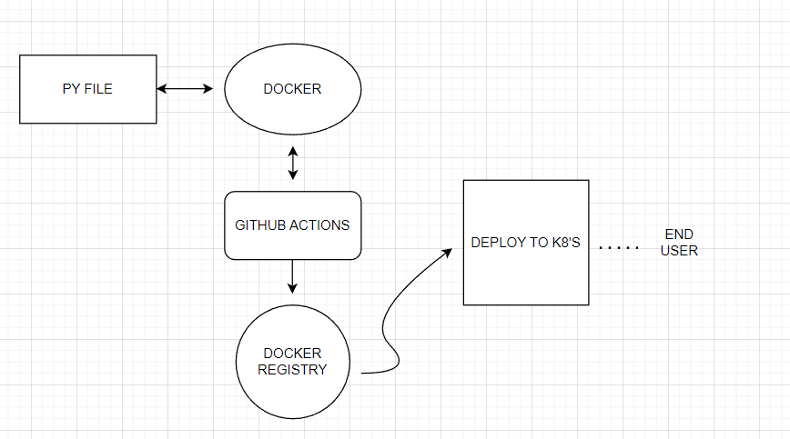

# FINAL_BLIND

<h1>Welcome to Blind Navigation System Project!</h1>

<body>
    <li>This project is built based on <b>MLOPS maturity level 3</b>. </li>
    <li>This includes <b>github actions</b>, <b>docker</b>, <b>CI/ CD (continous delivery and 
          continuous deployment)</b> and <b>K8's</b> (to auto scale)!</li>
    <li> This is basically a <b>object detection model</b>( <b>yolo v8</b>) with the <b>distance estimation</b>.</li>
    <li>I basically built the app if any object near to 5 meter, it will provide the audio signal to user with the object name and distance of the object!</li>
    <li>Basically I got the repo from here <a href="https://github.com/HassanBinHaroon/object_detection-PLUS-distance_estimation-v1">GitHub</a>. I just implemented with some modification! </li>
    <li>I have tried some other apporaches but I not able to figure it out!</li>
    

## Workflow Diagram: 

 
