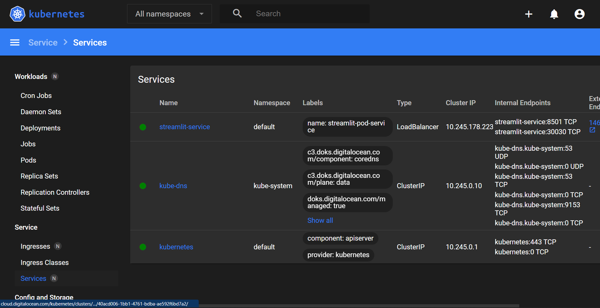

# FINAL_BLIND

<h1>Welcome to Blind Navigation System Project!</h1>

<body>
    <li>This project is built based on <b>MLOPS maturity level 3</b>. </li>
    <li>This includes <b>github actions</b>, <b>docker</b>, <b>CI/ CD (continous delivery and 
          continuous deployment)</b> and <b>K8's</b> (to auto scale)!</li>
    <li> This is basically a <b>object detection model</b>( <b>yolo v8</b>) with the <b>distance estimation</b>.</li>
    <li>I basically built the app if any object near to 5 meter, it will provide the audio signal to user with the object name and distance of the object!</li>
    <li>Basically I got the repo from here <a href="https://github.com/HassanBinHaroon/object_detection-PLUS-distance_estimation-v1">GitHub</a>. I just implemented with some modification! </li>
    <li>I have tried some other apporaches but I not able to figure it out!</li>
    <li> If I had a team, it would be better.!</li>
    
## Link to access the project: 
* If the link is not working sorry for that, Digital ocean has some problem today or some main mistake from my side. 
* Link: http://146.190.8.232:8501/
* You can access directly, it's a streamlit! 

## Workflow Diagram: 

 

## User Interface: 

 

## Kube Interface: 

 
